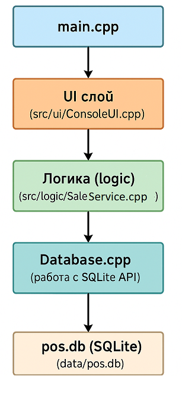

# POS-система (Point of Sale)

***POS-система (Point of Sale)*** — это программа, которая помогает магазину или кафе вести учёт товаров, клиентов и продаж.

Функционал:
1. ***Управление товарами***:
    - Добавление / редактирование / удаление товара
    - Отображение списка товаров
    - Поиск по названию
    - Учет остатков (stock уменьшается при продаже)

2. ***Продажа***:
    - Ввод списка продуктов с указанием количества
    - Расчёт:
        * Сумма без налогов
        * Скидки на уровне товара и/или чека
        * Налог на уровне товара
    - Сохранение чека в таблицы `sales` и `sale_items`
    - Вывод чека в консоль или файл

3. ***Клиенты***
    - Регистрация клиента
    - Привязка клиента к чеку (по желанию)
    - Возможность анализа покупок по клиенту

4. ***Сотрудники***
    - Добавление сотрудников
    - Простая авторизация
    - Логирование, кто провел продажу

5. ***Отчёты***
    - Ежедневные/ежемесячные продажи
    - Продажи по сотруднику
    - Продажи по клиенту
    - Остатки на складе
    - Самые продаваемые товары


### Предполагаемая структура проекта

/pos-system/
├── CMakeLists.txt
├── main.cpp
├── src/
│   ├── db/
│   │   ├── Database.cpp
│   │   ├── ProductDAO.cpp
│   │   └── ...
│   ├── logic/
│   │   ├── SaleService.cpp
│   │   └── ...
│   └── ui/
│       ├── ConsoleUI.cpp
│       └── ...
├── include/
│   └── ...
└── data/
    └── pos.db


**CMakeLists.txt**
- Скрипт для сборки проекта через CMake
- Описывает, какие исходники компилировать, какие папки с заголовками подключать, где лежит SQLite


**main.cpp**
- Точка входа программы (int main()):
    * Инициализация базы данных
    * Создание основных объектов (UI, логика)
    * Запуск главного цикла программы

___

**src/** — исходный код; делится на подмодули по логике.
___

**src/db/** — работа с базой данных (DAO слой)
*DAO* — Data Access Object, слой, который общается с SQLite напрямую.
- Database.cpp
    * Отвечает за подключение к SQLite
    * Открывает/закрывает базу, выполняет SQL-запросы
    * Может содержать метод executeQuery(), executeUpdate() и т.п.
- ProductDAO.cpp
    * Класс для работы только с таблицей products
    * Методы типа getAllProducts(), addProduct(), updateProductStock()
    * Получает/отправляет данные в Database

(и т.д. для CustomerDAO, SaleDAO)
 ___

**src/logic/** — бизнес-логика
Здесь код, который реализует правила работы POS-системы.
- SaleService.cpp
    - Регистрирует продажи
    - Считает скидки и налоги
    - Обновляет остатки на складе
    - Записывает результат в базу через DAO
(и т.д. для ProductService, CustomerService, EmployeeService)

Можно добавить ReportGenerator.cpp для отчётов

___

**src/ui/** — интерфейс пользователя
Отвечает за ввод/вывод данных.
- ConsoleUI.cpp
    - Консольное меню (текстовый интерфейс)
    - Спрашивает пользователя, что он хочет сделать
    - Передаёт команды в бизнес-логику (SaleProcessor, ProductDAO и др.)
    - Показывает результаты (списки товаров, отчёты)

Можно добавить QtUI.cpp или что-то другое

___

**include/** — заголовочные файлы
Хранят .h (или .hpp) файлы для всех .cpp из src/
Пример: include/db/Database.h, include/logic/SaleProcessor.h
Нужны, чтобы отделить интерфейс класса от его реализации

___

**data/** — данные программы
pos.db — сама база данных SQLite
Тут же можно хранить тестовые дампы (init.sql), чтобы быстро заполнить базу стартовыми данными


### Схема взаимодействия




### Папки logic

Папки `\src\logic\` и `\include\logic\` - хранят в себе файлы реализации и заголовочные файлы следующих классов: `ProductService`, `CustomerService`, `EmployeeService`, `SaleService`, - они призваны инкапсулировать в себе все всю бизнесс логику, то есть мы хотим создать прослойки между базой данных и интерфейсом, которые будет содержать в себе все функции, необходимые пользователю. Поговорим о каждом из перечисленных классов отдельно и определим, какими методами он должен обладать:

**1. ProductService**
Отвечает за управление товарами и их остатками.
Методы:
- `addProduct(name, price, stock, tax_rate, discount)` — добавление нового товара.
- `updateProduct(id, name, price, stock, tax_rate, discount)` — обновление данных товара.
- `deleteProduct(id)` — удаление товара.
- `getAllProducts()` — возврат списка всех товаров.
- `searchProductsByName(name)` — поиск товаров по названию.
- `updateStock(product_id, quantity)` — обновление остатков (уменьшение при продаже или ручное изменение).
- `getProductById(id)` — получение информации о конкретном товаре.

Возможные дополнения:
- Можно добавить методы для применения скидок/налогов к товарам, например `applyDiscount(product_id, discount)`.
- Для отчётов: `getLowStockProducts(threshold)` — возвращает товары с остатком ниже указанного порога.

**2. CustomerService**
Управление клиентами и их покупками.
Методы:
- `registerCustomer(name, email, phone)` — регистрация нового клиента.
- `updateCustomer(id, name, email, phone)` — обновление данных клиента.
- `deleteCustomer(id)` — удаление клиента (мягкое или жесткое, в зависимости от требований).
- `getAllCustomers()` — список всех клиентов.
- `getCustomerById(id)` — информация о клиенте.
- `getCustomerPurchases(id)` — возврат истории покупок клиента.
- `findCustomerByEmailOrPhone(query)` — поиск клиента по email или телефону.

Возможные дополнения:
- `getTopCustomersBySpending(limit)` — клиенты с наибольшими суммами покупок.
- `getCustomersByPurchaseCount(min_orders)` — фильтрация по количеству заказов.

**3. EmployeeService**
Работа с сотрудниками и их авторизацией.
Методы:
- `addEmployee(name, role, login, password)` — добавление сотрудника.
- `updateEmployee(id, name, role)` — обновление данных (без логина/пароля для безопасности).
- `deleteEmployee(id)` — удаление сотрудника.
- `authenticate(login, password)` — проверка учетных данных (возвращает Employee или nullptr).
- `getAllEmployees()` — список всех сотрудников.
- `getEmployeeById(id)` — информация о сотруднике.
- `changePassword(id, new_password)` — смена пароля.

Возможные дополнения:
- Для отчётов: `getSalesByEmployee(id, start_date, end_date)` — продажи сотрудника за период.
- `getEmployeesByRole(role)` — фильтрация по должности.


**4. SaleService**
Обработка продаж, расчеты и формирование чеков.
Методы:
- `createSale(employee_id, customer_id = nullptr)` — создание новой продажи (возвращает sale_id).
- `addProductToSale(sale_id, product_id, quantity)` — добавление товара в чек с расчетом цены, скидки и налога.
- `applySaleDiscount(sale_id, discount)` — скидка на весь чек.
- `finalizeSale(sale_id)` — завершение продажи:
- Расчет итоговой суммы (с учетом налогов и скидок).
- Обновление остатков товаров через `ProductService`.
- Сохранение чека в `sales` и `sale_items`.
- `getSaleDetails(sale_id)` — информация о конкретном чеке.
- `printReceipt(sale_id, output_type)` — вывод чека в консоль/файл (формат: текст или PDF).

Возможные дополнения:
- Для аналитики: `getSalesReport(start_date, end_date)` — отчет по продажам за период.
- `getTopSellingProducts(limit)` — самые популярные товары.


**5. ReportGenerator**
Генерация сложных отчетов.
Методы:
- `generateDailySalesReport(date)` — дневной отчет.
- `generateMonthlySalesReport(month, year)` — месячный отчет.
- `generateInventoryReport()` — остатки на складе.
- `exportReportToFile(report_data, format)` — экспорт в CSV/PDF


### Папки db
Папки `\src\db\` и `\include\db\` - хранят в себе файлы реализации и заголовочные файлы следующих классов: `Database`, `CustomerDAO`, `ProductDAO`, `SaleDAO`, `EmployeeDAO` - эти компоненты отвечают исключительно за работу с базой данных, но не содержат бизнес-логики. Их задача — выполнять CRUD-операции (Create, Read, Update, Delete) и предоставлять данные в удобном формате для сервисов.
Поговорим о каждом из перечисленных классов отдельно и определим, какими методами он должен обладать:

**1. Класс Database**
Обёртка над подключением к SQLite, управление транзакциями и выполнение запросов. `DAO` используют класс `Database` как прослойку:
- `Database` предоставляет высокоуровневые методы (`executeQuery`, `executeUpdate`), которые инкапсулируют работу с SQLite API.
- `DAO` вызывают эти методы, передавая SQL и параметры.

Такой подход выгоден сразу по нескольким причинам:
- Упрощение `DAO`: меньше кода, нет дублирования.
- Централизованное управление ошибками и транзакциями.
- Легче подменить БД (например, на PostgreSQL) — меняется только Database.

Функционал:
- Подключение/отключение
- Выполнение запросов
- Транзакции

**2. CustomerDAO, ProductDAO, SaleDAO, EmployeeDAO**
Нет смысла рассказывать про каждый из этих классов по отдельности, каждый из них предоставляет информацию, запрашиваемую соответствующими `Service` в удобном формате


### Папки ui
Папки `\src\ui\` и `\include\ui\` - хранят в себе файл реализации и заголовочный файл класса: `ConsoleUI` - он содержит интерфейс приложения.
Поскольку с точки зрения архитектуры было бы правильно вынести реализацию из `main` в отдельный файл, то необходим класс `ConsoleUI`, который будет инкапсулировать в себе весь функционал взаимодейсвия с пользователем. Более того, одним из запросов при дальнейшем развитии проекта может быть создание оконного приложения, что потребует полной переработки интерфейса, то есть его компоненты должны быть аккуратно выделены в отдельные файлы.

### Примерная структура таблиц 

```sql
-- Таблица сотрудников
CREATE TABLE employees (
    id INTEGER PRIMARY KEY AUTOINCREMENT,
    name TEXT NOT NULL,
    role TEXT,
    login TEXT UNIQUE,
    password TEXT
);

-- Таблица клиентов
CREATE TABLE customers (
    id INTEGER PRIMARY KEY AUTOINCREMENT,
    name TEXT NOT NULL,
    email TEXT,
    phone TEXT
);

-- Таблица продуктов
CREATE TABLE products (
    id INTEGER PRIMARY KEY AUTOINCREMENT,
    name TEXT NOT NULL,
    price REAL NOT NULL,
    stock INTEGER NOT NULL,
    tax_rate REAL DEFAULT 0.0,
    discount REAL DEFAULT 0.0
);

-- Таблица продаж (чеков)
CREATE TABLE sales (
    id INTEGER PRIMARY KEY AUTOINCREMENT,
    customer_id INTEGER,
    employee_id INTEGER,
    total REAL,
    date TEXT,
    FOREIGN KEY(customer_id) REFERENCES customers(id),
    FOREIGN KEY(employee_id) REFERENCES employees(id)
);

-- Таблица позиций в продаже (проданные товары)
CREATE TABLE sale_items (
    id INTEGER PRIMARY KEY AUTOINCREMENT,
    sale_id INTEGER,
    product_id INTEGER,
    quantity INTEGER,
    unit_price REAL,
    discount REAL,
    tax REAL,
    FOREIGN KEY(sale_id) REFERENCES sales(id),
    FOREIGN KEY(product_id) REFERENCES products(id)
);
```


## Реализация

